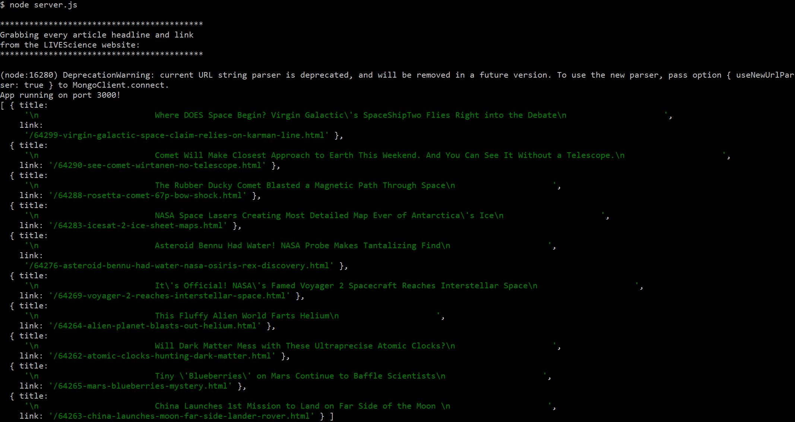

# NewsScrapper
GW Homework Week 18

This app allows the user to view Live Science articles, save their favorites onto another page, and comment on the saved articles. Each article is displayed with a headline which is also a link to the source of the article and a brief description that includes the published date. All articles are presented by <a href="https://www.livescience.com/space?type=article " target="_blank">LiveScience</a>.

This app uses the technologies listed below:

<ol>
    <li>Express</li>
    <li>Express-handlebars</li>
    <li>Mongoose</li>
    <li>Cherrio</li>
    <li>Axios</li>
</ol>

<h2>Demo</h2>
NewsScrapper is deployed to Heroku. Please check it out <a href="https://news-scrapper18.herokuapp.com/" target="_blank">here</a>.

<h2>Installation</h2>
To install the application follow the instructions below:
<ol>
    <li>git clone git@github.com:valfragier16/NewsScrapper.git</li>
    <li>cd NewsScrapper</li>
    <li>npm install</li>

<h2>Run Locally</h2>
Once you have completed the installation, to access the application in your browser, first run <i>node server.js</i> in your terminal within the <i>NewsScrapper</i> folder.
If done properly, your terminal should display the following, which will include a list of articles and their links:

